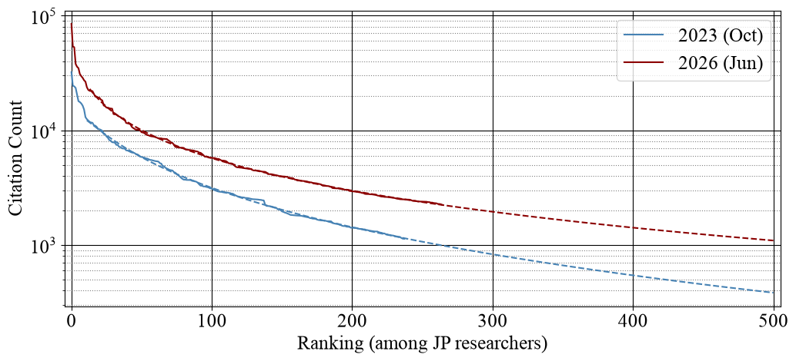

# 日本人機械学習研究者の引用数ランキング

**免責事項:** このランキングは非公式なものであり、完全な正確性を保証するものではありません。
Pythonスクリプトによる自動化の限界により、「日本人」研究者を特定するための基準は簡易的なものであり、国籍や民族を厳密に表すものではありません。

横軸は日本人内のランキングを、縦軸はGoogle Scholarにおける総引用数を示しています。また、対応するランキングにおける総引用数の予測値を点線によって表示しています。

## 日本人機械学習研究者の定義
正確な手法は [実行スクリプト](./extract_japanese.py) 内で定義されています。
大きく分けると以下の2つの要素に基づいてプロフィールを抽出しています。
1. 研究者の苗字が伝統的な日本の苗字のリストに含まれるか。
    - [Claude CodeのSkills](.claude/skills/check-jp-names/) によって、偽陰性率を減らすように努めました。
2. Google Scholarのプロフィールで `machine_learning` とラベル付されているか。

> [!IMPORTANT]
> 日本人の分類において、日本国外の出自や文化的背景を持つ人々を差別する意図はありません。この定義は大体の統計的傾向を知るために必要な自動化として現実的であるという理由で採用されました。ただし、この手法には必然的に以下のような限界があることにご注意ください。
> * 伝統的ではない苗字を持つ日本人研究者、Google Scholarの公開プロフィールを持たない研究者、異なるプロフィールラベル（`AI` や `Deep_Learning` など）を使用している研究者が除外されること。
> * 日本国籍を持たない、あるいは日本を拠点としていないが、伝統的な日本の苗字を持つ世界中の日系研究者が含まれること。

> [!NOTE]
> 2023年と2026年の両方について、Google Scholarの上位20,000件のプロフィールを調査しました。2026年版の全体データは手動で地道に集めました。

## データの出典
2026年版の出典は6月21日付に Google Scholar で公開されていた情報を参照しています。
2023年版については[2023年のレポート](https://research-p.com/column/1491)を流用しています。

なお、双方ともに [JSON形式](raw/) でMITライセンスの元、公開しております。
